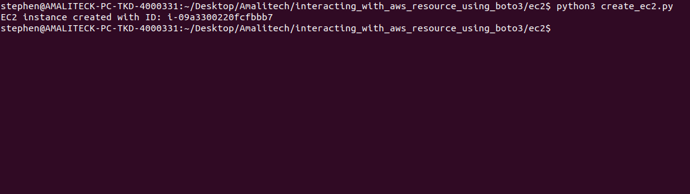
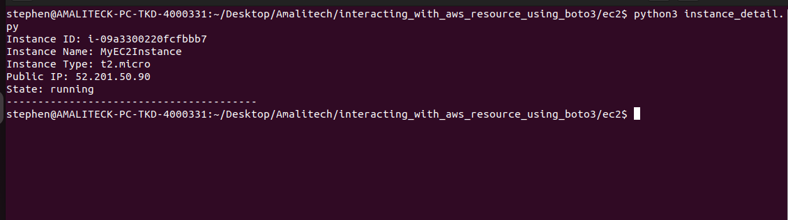
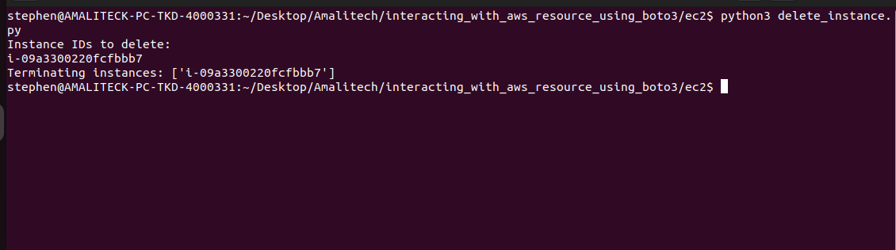
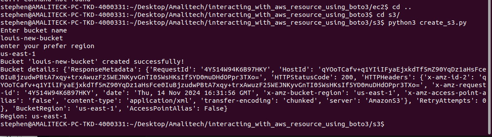
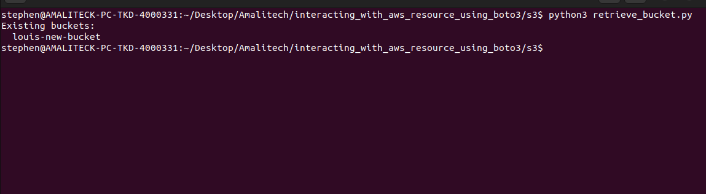
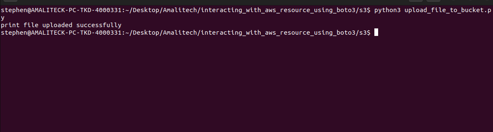
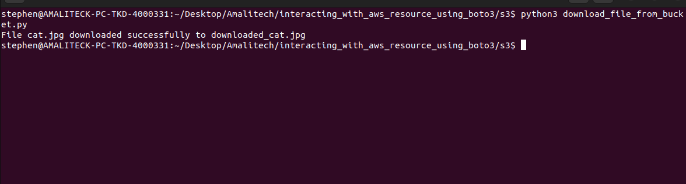
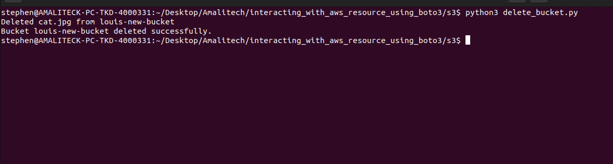

# interacting_with_aws_resource_using_boto3

1. **Clone the Repository:**
   ```bash
    git clone https://github.com/BINAH25/interacting_with_aws_resource_using_boto3.git
    cd interacting_with_aws_resource_using_boto3

2. **Create Virtual Environment:**
   ```bash
   python -m venv venv
   source venv/bin/activate  # On Windows, use `venv\Scripts\activate`

3. **Install the requires packages:**
   ```bash
   pip install -r requirements.txt


4. **Create an .env file with the following details:**
   ```bash
    Image_ID = ''
    Min_Count = ''
    Max_Count = ''
    Instance_Type = ''         
    Key_Name = ''       

## Interation with AWS EC2

1. **create an instance:**
   ```bash
    cd ec2
    python3 create_ec2.py
    


2. **get an instance details:**
   ```bash
    python3 instance_detail.py



3. **delete an instance:**
   ```bash
    python3 delete_instance.py



## Interation with AWS S3

1. **create an instance:**
   ```bash
    cd s3
    python3 create_s3.py



2. **retrieve bucket(s):**
   ```bash
    python3 retrieve_bucket.py



3. **upload file to bucket:**
   ```bash
    python3 upload_file_to_bucket.py



4. **download file from bucket:**
   ```bash
    python3 download_file_from_bucket.py



5. **delete bucket:**
   ```bash
    python3 delete_bucket.py

